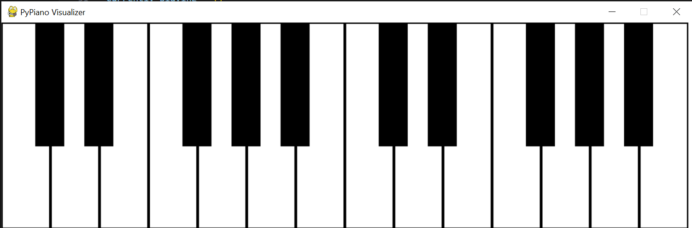

# Random Note Generator and FluidSynth Player

This project generates a random MIDI note and plays it using the FluidSynth library, a real-time software synthesizer based on the SoundFont format.

## Description

This project includes:
- **`randomNote.py`**: A script that generates a random MIDI note and converts it to its corresponding musical note name (e.g., C4, D#5).
- **`main.py`**: A script that allows you to play a functional 2 octave piano with your keyboard.


## Requirements

Before running the project, make sure you have the following installed:
- Python 3.x
- [FluidSynth](https://ksvi.mff.cuni.cz/~dingle/2019/prog_1/python_music.html) <- drections of installation
- A SoundFont file (e.g., `FluidR3_GM.sf2`), can be downloaded [here](https://keymusician01.s3.amazonaws.com/FluidR3_GM.zip)
- a midi File (e.g. `book1-prelude01.mid`), can also be downloaded [here](https://www.mfiles.co.uk/downloads/book1-prelude01.mid). After downloading both files, place them under the `config` folder.
After following the website, you can install the required Python packages by running:

```bash
pip install fluidsynth
